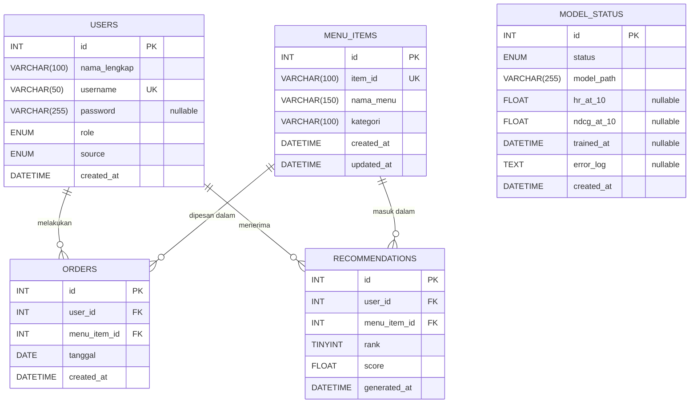
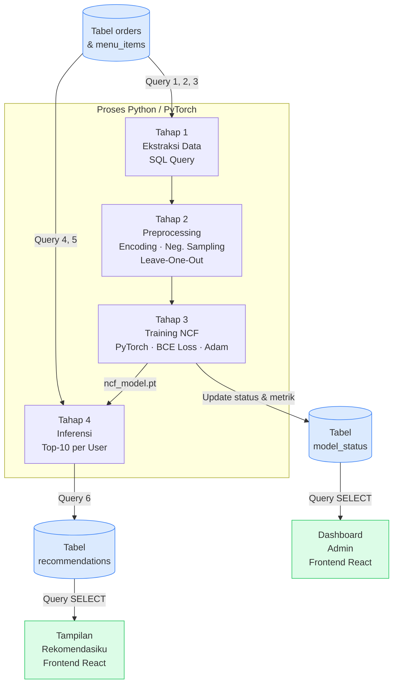

# 3.3 Perancangan Basis Data

Perancangan basis data sistem rekomendasi menu ini menghasilkan lima tabel
relasional yang dinormalisasi hingga Bentuk Normal Ketiga (3NF). Normalisasi
hingga 3NF dipilih untuk menghilangkan anomali manipulasi data (*insert*,
*update*, *delete*) sekaligus menjaga kesederhanaan struktur yang sesuai
dengan kebutuhan sistem berskala kecil ini. Kelima tabel tersebut adalah
`users`, `menu_items`, `orders`, `recommendations`, dan `model_status`.

---

## 3.3.1 Rekomendasi *Tech Stack*

Pemilihan *tech stack* didasarkan pada dua pertimbangan utama: integrasi
ekosistem dan kesederhanaan arsitektur yang sesuai untuk sistem eksperimental.

### *Backend*: FastAPI (Python)

FastAPI dipilih sebagai *framework backend* karena berada dalam ekosistem
Python yang sama dengan *library* PyTorch yang digunakan untuk model NCF.
Integrasi langsung antara *layer* API dan model *machine learning*
menghilangkan kebutuhan komunikasi lintas proses (*inter-process
communication*), sehingga menyederhanakan arsitektur sistem secara
keseluruhan. Sebagai perbandingan, penggunaan Express.js (Node.js) sebagai
alternatif akan memerlukan jembatan tambahan antara lingkungan Node dan Python
untuk menjalankan inferensi model — sebuah kompleksitas yang tidak perlu
dalam konteks penelitian ini.

### *Database*: MySQL 8.x

MySQL dipilih sebagai sistem manajemen basis data relasional karena mendukung
seluruh kebutuhan relasional sistem ini. Dengan volume data yang relatif kecil
(di bawah 10.000 *record*), MySQL mampu memenuhi kebutuhan performa sistem
secara memadai. Selain itu, MySQL versi 8.x mendukung *window function*
(`ROW_NUMBER() OVER`) yang digunakan dalam strategi *leave-one-out* pada
tahap ekstraksi data.

### Ringkasan *Stack* Sistem

| Komponen | Teknologi | Versi |
|---|---|---|
| *Frontend* | React.js | 18+ |
| *Backend* | FastAPI | 0.110+ |
| Model ML | PyTorch | 2.x |
| *Database* | MySQL | 8.x |
| ORM | SQLAlchemy | 2.x |
| Autentikasi | JWT (*JSON Web Token*) | — |

---

## 3.3.2 *Entity Relationship Diagram* (ERD)

*Entity Relationship Diagram* (ERD) berikut menggambarkan struktur dan relasi
kelima tabel basis data sistem rekomendasi menu. Tabel `model_status` berdiri
independen tanpa *foreign key* ke tabel lain karena berfungsi sebagai log
monitoring siklus hidup model NCF.

**Gambar 3.X *Entity Relationship Diagram* Basis Data Sistem Rekomendasi**



---

## 3.3.3 Skema Tabel

### 3.3.3.1 Tabel `users`

Tabel `users` berfungsi menyimpan data akun seluruh pengguna sistem, mencakup
aktor Admin dan User. Pembedaan peran dilakukan melalui kolom `role` sehingga
seluruh aktor cukup dikelola dalam satu tabel tanpa perlu pemisahan tabel per
peran. Kolom `source` membedakan dua populasi pengguna: entitas historis yang
diimpor dari data No Transaksi kafe, dan pengguna yang mendaftar secara
mandiri melalui halaman *Register*. Kolom `password` bersifat *nullable*
karena entitas historis tidak memiliki kredensial *login*.

**Tabel 3.26 Struktur Tabel `users`**

| No | Nama *Field* | Tipe Data | Panjang | *Constraint* | Keterangan |
|:--:|---|---|:--:|---|---|
| 1 | `id` | INT | — | PK, AUTO_INCREMENT, NOT NULL | Identitas unik pengguna (*surrogate key*) |
| 2 | `nama_lengkap` | VARCHAR | 100 | NOT NULL | Nama lengkap pengguna |
| 3 | `username` | VARCHAR | 50 | UNIQUE, NOT NULL | Nama pengguna untuk autentikasi *login*, bersifat unik dalam sistem |
| 4 | `password` | VARCHAR | 255 | NULL | Kata sandi dalam bentuk *hash* (bcrypt) — `NULL` untuk entitas historis yang tidak dapat *login* |
| 5 | `role` | ENUM | — | NOT NULL, DEFAULT `'user'` | Peran pengguna: `'admin'` atau `'user'` |
| 6 | `source` | ENUM | — | NOT NULL, DEFAULT `'registered'` | Asal pengguna: `'historical'` (diimpor dari data kafe) atau `'registered'` (daftar via aplikasi) |
| 7 | `created_at` | DATETIME | — | NOT NULL, DEFAULT `CURRENT_TIMESTAMP` | Waktu akun pengguna pertama kali dibuat |

---

### 3.3.3.2 Tabel `menu_items`

Tabel `menu_items` berfungsi sebagai data *master* katalog menu kafe. Kolom
`item_id` menyimpan string penuh produk dari sistem POS kafe sebagai *natural
key* yang bersifat unik — format: `{kode} - {nama varian}`, contoh:
`A01E - CAPPUCCINO / COLD REGULAR`. Pendekatan ini diperlukan karena satu kode
dasar (misal `A01E`) dapat memiliki beberapa varian ukuran/suhu yang masing-masing
diperlakukan sebagai item berbeda oleh model NCF. Kolom `id` berfungsi sebagai
*surrogate key* untuk kebutuhan relasi antar tabel.

**Tabel 3.27 Struktur Tabel `menu_items`**

| No | Nama *Field* | Tipe Data | Panjang | *Constraint* | Keterangan |
|:--:|---|---|:--:|---|---|
| 1 | `id` | INT | — | PK, AUTO_INCREMENT, NOT NULL | Identitas unik menu (*surrogate key*) |
| 2 | `item_id` | VARCHAR | 100 | UNIQUE, NOT NULL | String penuh produk dari POS (contoh: `A01E - CAPPUCCINO / COLD REGULAR`) |
| 3 | `nama_menu` | VARCHAR | 150 | NOT NULL | Nama menu yang ditampilkan di katalog |
| 4 | `kategori` | VARCHAR | 100 | NOT NULL | Kategori menu (contoh: `Kopi & Espresso`, `Nasi Goreng`) |
| 5 | `created_at` | DATETIME | — | NOT NULL, DEFAULT `CURRENT_TIMESTAMP` | Waktu data menu pertama kali ditambahkan |
| 6 | `updated_at` | DATETIME | — | NOT NULL, DEFAULT `CURRENT_TIMESTAMP ON UPDATE CURRENT_TIMESTAMP` | Waktu data menu terakhir diperbarui |

---

### 3.3.3.3 Tabel `orders`

Tabel `orders` menyimpan riwayat interaksi antara pengguna dan menu yang
berfungsi sebagai sumber *implicit feedback* untuk model NCF. Setiap baris
merepresentasikan satu pasangan interaksi positif `(user, item)` — menu yang
benar-benar pernah dipesan. Tabel ini **hanya menyimpan interaksi positif**;
tidak ada kolom `label` karena seluruh baris yang masuk ke tabel ini sudah
secara inheren bernilai positif. *Negative sampling* (pembangkitan pasangan
negatif) dilakukan secara *runtime* di dalam skrip Python saat *preprocessing*
dan tidak pernah disimpan ke basis data.

**Tabel 3.28 Struktur Tabel `orders`**

| No | Nama *Field* | Tipe Data | Panjang | *Constraint* | Keterangan |
|:--:|---|---|:--:|---|---|
| 1 | `id` | INT | — | PK, AUTO_INCREMENT, NOT NULL | Identitas unik data pemesanan |
| 2 | `user_id` | INT | — | FK → `users.id`, NOT NULL | Referensi ke pengguna yang melakukan pemesanan |
| 3 | `menu_item_id` | INT | — | FK → `menu_items.id`, NOT NULL | Referensi ke menu yang dipesan |
| 4 | `tanggal` | DATE | — | NOT NULL | Tanggal transaksi asli dari kafe — digunakan sebagai dasar pengurutan kronologis pada strategi *leave-one-out* |
| 5 | `created_at` | DATETIME | — | NOT NULL, DEFAULT `CURRENT_TIMESTAMP` | Waktu baris data dicatat ke dalam sistem |

---

### 3.3.3.4 Tabel `recommendations`

Tabel `recommendations` menyimpan hasil keluaran (*output*) model NCF berupa
daftar Top-10 menu yang direkomendasikan untuk setiap pengguna. Tabel ini
berfungsi sebagai *cache* komputasi sehingga proses inferensi model tidak
perlu dijalankan ulang setiap kali pengguna mengakses halaman rekomendasi.
Data diperbarui melalui strategi *full replace per user* setiap kali retrain
selesai dijalankan. Dua *constraint* UNIQUE bersama-sama menjamin bahwa
daftar Top-10 setiap pengguna terdiri dari 10 menu unik dengan 10 peringkat
unik.

**Tabel 3.29 Struktur Tabel `recommendations`**

| No | Nama *Field* | Tipe Data | Panjang | *Constraint* | Keterangan |
|:--:|---|---|:--:|---|---|
| 1 | `id` | INT | — | PK, AUTO_INCREMENT, NOT NULL | Identitas unik baris rekomendasi |
| 2 | `user_id` | INT | — | FK → `users.id`, NOT NULL | Referensi ke pengguna penerima rekomendasi |
| 3 | `menu_item_id` | INT | — | FK → `menu_items.id`, NOT NULL | Referensi ke menu yang direkomendasikan |
| 4 | `rank` | TINYINT | — | NOT NULL, UNIQUE bersama `user_id` | Peringkat rekomendasi: `1` (paling relevan) hingga `10` |
| 5 | `score` | FLOAT | — | NOT NULL | Skor probabilitas *sigmoid* dari model NCF (rentang `0.0`–`1.0`) |
| 6 | `generated_at` | DATETIME | — | NOT NULL, DEFAULT `CURRENT_TIMESTAMP` | Waktu rekomendasi di-*generate* oleh model NCF |

---

### 3.3.3.5 Tabel `model_status`

Tabel `model_status` berfungsi sebagai log riwayat pelatihan model NCF
sekaligus sumber informasi status model yang ditampilkan di *Dashboard* Admin.
Setiap baris merepresentasikan satu sesi pelatihan. Model yang sedang aktif
adalah baris dengan `status = 'ready'` dan nilai `trained_at` terbaru. Tabel
ini tidak memiliki *foreign key* ke tabel lain karena berfungsi sebagai log
monitoring yang independen dari data pengguna dan menu.

**Tabel 3.30 Struktur Tabel `model_status`**

| No | Nama *Field* | Tipe Data | Panjang | *Constraint* | Keterangan |
|:--:|---|---|:--:|---|---|
| 1 | `id` | INT | — | PK, AUTO_INCREMENT, NOT NULL | Identitas unik setiap sesi pelatihan model |
| 2 | `status` | ENUM | — | NOT NULL, DEFAULT `'ready'` | Status sesi: `'training'` (sedang berjalan), `'ready'` (berhasil), `'error'` (gagal) |
| 3 | `model_path` | VARCHAR | 255 | NOT NULL | *Path* file bobot model PyTorch (`.pt`) di *server* |
| 4 | `hr_at_10` | FLOAT | — | NULL | Nilai metrik *Hit Ratio*@10 hasil evaluasi — `NULL` jika pelatihan belum selesai |
| 5 | `ndcg_at_10` | FLOAT | — | NULL | Nilai metrik NDCG@10 hasil evaluasi — `NULL` jika pelatihan belum selesai |
| 6 | `trained_at` | DATETIME | — | NULL | Waktu pelatihan selesai — `NULL` jika masih berjalan atau gagal |
| 7 | `error_log` | TEXT | — | NULL | Pesan *error* jika pelatihan gagal — `NULL` jika berhasil |
| 8 | `created_at` | DATETIME | — | NOT NULL, DEFAULT `CURRENT_TIMESTAMP` | Waktu Admin menekan tombol "Retrain Model" |

---

## 3.3.4 SQL *Script* `CREATE TABLE`

*Script* SQL berikut membuat seluruh struktur basis data sistem rekomendasi
menu. Urutan pembuatan tabel mengikuti dependensi *foreign key*: tabel yang
tidak memiliki referensi ke tabel lain dibuat terlebih dahulu sebelum tabel
yang mereferensikannya.

```sql
-- ================================================================
--  Nama Database  : sakkabase_ncf
--  Sistem         : Sistem Rekomendasi Menu Sakka Base
--  Metode         : Neural Collaborative Filtering (NCF)
--  DBMS           : MySQL 8.x
--  Charset        : utf8mb4 (mendukung karakter khusus Unicode penuh)
-- ================================================================

CREATE DATABASE IF NOT EXISTS sakkabase_ncf
    CHARACTER SET utf8mb4
    COLLATE utf8mb4_unicode_ci;

USE sakkabase_ncf;


-- ----------------------------------------------------------------
-- TABEL 1 : users
-- Fungsi   : Menyimpan akun Admin, User terdaftar, dan entitas
--            historis No Transaksi kafe
-- ----------------------------------------------------------------
CREATE TABLE users (
    id           INT                              NOT NULL AUTO_INCREMENT,
    nama_lengkap VARCHAR(100)                     NOT NULL,
    username     VARCHAR(50)                      NOT NULL,
    password     VARCHAR(255)                         NULL,
    role         ENUM('admin','user')             NOT NULL DEFAULT 'user',
    source       ENUM('historical','registered')  NOT NULL DEFAULT 'registered',
    created_at   DATETIME                         NOT NULL DEFAULT CURRENT_TIMESTAMP,

    CONSTRAINT pk_users          PRIMARY KEY (id),
    CONSTRAINT uq_users_username UNIQUE      (username)

) ENGINE = InnoDB
  DEFAULT CHARSET = utf8mb4
  COLLATE = utf8mb4_unicode_ci
  COMMENT = 'Akun seluruh pengguna: Admin, User terdaftar, dan entitas historis';


-- ----------------------------------------------------------------
-- TABEL 2 : menu_items
-- Fungsi   : Data master katalog menu kafe
-- ----------------------------------------------------------------
CREATE TABLE menu_items (
    id         INT          NOT NULL AUTO_INCREMENT,
    item_id    VARCHAR(100) NOT NULL,
    nama_menu  VARCHAR(150) NOT NULL,
    kategori   VARCHAR(100) NOT NULL,
    created_at DATETIME     NOT NULL DEFAULT CURRENT_TIMESTAMP,
    updated_at DATETIME     NOT NULL DEFAULT CURRENT_TIMESTAMP
                                     ON UPDATE CURRENT_TIMESTAMP,

    CONSTRAINT pk_menu_items         PRIMARY KEY (id),
    CONSTRAINT uq_menu_items_item_id UNIQUE      (item_id)

) ENGINE = InnoDB
  DEFAULT CHARSET = utf8mb4
  COLLATE = utf8mb4_unicode_ci
  COMMENT = 'Data master katalog menu kafe Sakka Base';


-- ----------------------------------------------------------------
-- TABEL 3 : orders
-- Fungsi   : Riwayat interaksi positif sebagai implicit feedback NCF
-- Catatan  : Hanya menyimpan interaksi positif (menu yang dipesan).
--            Negative sampling dilakukan secara runtime di Python,
--            tidak disimpan ke basis data.
-- ----------------------------------------------------------------
CREATE TABLE orders (
    id           INT      NOT NULL AUTO_INCREMENT,
    user_id      INT      NOT NULL,
    menu_item_id INT      NOT NULL,
    tanggal      DATE     NOT NULL,
    created_at   DATETIME NOT NULL DEFAULT CURRENT_TIMESTAMP,

    CONSTRAINT pk_orders PRIMARY KEY (id),

    CONSTRAINT fk_orders_user_id
        FOREIGN KEY (user_id)
        REFERENCES users(id)
        ON DELETE CASCADE
        ON UPDATE CASCADE,

    CONSTRAINT fk_orders_menu_item_id
        FOREIGN KEY (menu_item_id)
        REFERENCES menu_items(id)
        ON DELETE RESTRICT
        ON UPDATE CASCADE,

    INDEX idx_orders_user_id      (user_id),
    INDEX idx_orders_menu_item_id (menu_item_id),
    INDEX idx_orders_tanggal      (tanggal)

) ENGINE = InnoDB
  DEFAULT CHARSET = utf8mb4
  COLLATE = utf8mb4_unicode_ci
  COMMENT = 'Riwayat pemesanan positif sebagai implicit feedback model NCF';


-- ----------------------------------------------------------------
-- TABEL 4 : recommendations
-- Fungsi   : Cache Top-10 rekomendasi model NCF per pengguna
-- Catatan  : Diperbarui dengan strategi full replace per user
--            (DELETE lama → INSERT baru) setiap kali retrain selesai
-- ----------------------------------------------------------------
CREATE TABLE recommendations (
    id           INT      NOT NULL AUTO_INCREMENT,
    user_id      INT      NOT NULL,
    menu_item_id INT      NOT NULL,
    rank         TINYINT  NOT NULL,
    score        FLOAT    NOT NULL,
    generated_at DATETIME NOT NULL DEFAULT CURRENT_TIMESTAMP,

    CONSTRAINT pk_recommendations        PRIMARY KEY (id),
    CONSTRAINT uq_rec_user_rank          UNIQUE (user_id, rank),
    CONSTRAINT uq_rec_user_item          UNIQUE (user_id, menu_item_id),

    CONSTRAINT fk_rec_user_id
        FOREIGN KEY (user_id)
        REFERENCES users(id)
        ON DELETE CASCADE
        ON UPDATE CASCADE,

    CONSTRAINT fk_rec_menu_item_id
        FOREIGN KEY (menu_item_id)
        REFERENCES menu_items(id)
        ON DELETE CASCADE
        ON UPDATE CASCADE,

    INDEX idx_rec_user_id      (user_id),
    INDEX idx_rec_menu_item_id (menu_item_id)

) ENGINE = InnoDB
  DEFAULT CHARSET = utf8mb4
  COLLATE = utf8mb4_unicode_ci
  COMMENT = 'Cache hasil Top-10 rekomendasi model NCF per pengguna';


-- ----------------------------------------------------------------
-- TABEL 5 : model_status
-- Fungsi   : Log riwayat pelatihan dan metrik evaluasi model NCF
-- Catatan  : Tidak memiliki foreign key ke tabel lain —
--            berfungsi sebagai tabel monitoring independen
-- ----------------------------------------------------------------
CREATE TABLE model_status (
    id          INT                              NOT NULL AUTO_INCREMENT,
    status      ENUM('training','ready','error') NOT NULL DEFAULT 'ready',
    model_path  VARCHAR(255)                     NOT NULL,
    hr_at_10    FLOAT                                NULL,
    ndcg_at_10  FLOAT                                NULL,
    trained_at  DATETIME                             NULL,
    error_log   TEXT                                 NULL,
    created_at  DATETIME                         NOT NULL DEFAULT CURRENT_TIMESTAMP,

    CONSTRAINT pk_model_status PRIMARY KEY (id),

    INDEX idx_model_status_status     (status),
    INDEX idx_model_status_trained_at (trained_at)

) ENGINE = InnoDB
  DEFAULT CHARSET = utf8mb4
  COLLATE = utf8mb4_unicode_ci
  COMMENT = 'Log riwayat pelatihan dan status aktif model NCF';
```

### Justifikasi Keputusan Teknis

**Mengapa `ENGINE = InnoDB`?**
InnoDB adalah *storage engine* MySQL yang mendukung *foreign key constraint*
dan transaksi ACID. Alternatif MyISAM tidak mendukung *foreign key*, sehingga
tidak cocok untuk basis data relasional yang memerlukan integritas referensial.

**Mengapa `CHARACTER SET utf8mb4`?**
`utf8mb4` mendukung penuh Unicode 4-*byte*, mencakup karakter khusus yang
mungkin muncul pada nama menu. Encoding `utf8` standar MySQL hanya mendukung
3-*byte* dan dapat gagal menyimpan karakter tertentu.

**Mengapa `ON DELETE RESTRICT` pada `fk_orders_menu_item_id`?**
Menu yang sudah memiliki riwayat pemesanan tidak boleh dihapus begitu saja,
karena data historis tersebut merupakan *input* krusial model NCF. Batasan
ini memaksa Admin untuk menangani data terdampak terlebih dahulu sebelum
menghapus menu dari katalog.

**Mengapa `ON DELETE CASCADE` pada *foreign key* lainnya?**
Rekomendasidapat di-*generate* ulang kapan saja sehingga aman dihapus
bersama data referensinya. Demikian pula, riwayat pemesanan seorang pengguna
tidak memiliki makna tanpa keberadaan akun pengguna tersebut.

---

## 3.3.5 Relasi Antar Tabel

Kelima tabel yang dirancang membentuk empat relasi *one-to-many* yang saling
mendukung, serta satu tabel monitoring independen. Seluruh relasi
diimplementasikan melalui mekanisme *foreign key* sehingga integritas
referensial basis data terjaga secara otomatis.

### a. Relasi `users` → `orders` (One-to-Many)

Satu pengguna (`users`) dapat memiliki banyak riwayat pemesanan (`orders`),
namun setiap baris pada tabel `orders` hanya mereferensikan tepat satu
pengguna. Relasi ini diimplementasikan melalui kolom `user_id` pada tabel
`orders` sebagai *foreign key* yang mereferensikan kolom `id` pada tabel
`users` dengan perilaku `ON DELETE CASCADE`.

Secara fungsional, relasi ini merepresentasikan seluruh riwayat interaksi
seorang pengguna dengan menu-menu yang pernah dipesannya — kumpulan inilah
yang menjadi *implicit feedback* pada pemodelan NCF.

### b. Relasi `menu_items` → `orders` (One-to-Many)

Satu menu (`menu_items`) dapat muncul pada banyak riwayat pemesanan (`orders`)
dari berbagai pengguna, namun setiap baris pada tabel `orders` hanya
mereferensikan tepat satu menu. *Foreign key* `menu_item_id` dikonfigurasi
dengan `ON DELETE RESTRICT` untuk melindungi data historis pemesanan dari
penghapusan menu yang tidak disengaja.

Secara fungsional, relasi ini memungkinkan sistem untuk memetakan popularitas
setiap menu berdasarkan frekuensi kemunculannya dalam riwayat pemesanan.

### c. Relasi `users` → `recommendations` (One-to-Many)

Satu pengguna (`users`) memiliki hingga sepuluh baris rekomendasi pada tabel
`recommendations`, sesuai dengan keluaran Top-10 model NCF. *Foreign key*
`user_id` dikonfigurasi dengan `ON DELETE CASCADE` sehingga rekomendasi ikut
terhapus ketika akun pengguna dihapus.

Secara fungsional, relasi ini memungkinkan sistem menyimpan dan mengambil
kembali hasil rekomendasi yang dipersonalisasi secara efisien tanpa menjalankan
ulang inferensi model di setiap *request*.

### d. Relasi `menu_items` → `recommendations` (One-to-Many)

Satu menu (`menu_items`) dapat muncul sebagai rekomendasi bagi banyak
pengguna, namun setiap baris pada tabel `recommendations` hanya mereferensikan
tepat satu menu. *Foreign key* `menu_item_id` dikonfigurasi dengan
`ON DELETE CASCADE` karena rekomendasi bersifat *regeneratable* — jika menu
dihapus dari katalog, baris rekomendasinya ikut dihapus dan model akan
menghasilkan rekomendasi baru tanpa menu tersebut.

Secara fungsional, relasi ini memungkinkan tampilan detail menu pada halaman
rekomendasi diperoleh melalui operasi *JOIN* antara tabel `recommendations`
dan `menu_items`, sehingga tidak ada duplikasi data nama menu.

### e. Tabel `model_status` — Monitoring Independen (Tanpa *Foreign Key*)

Tabel `model_status` tidak memiliki *foreign key* ke tabel manapun. Ini
disengaja karena tabel ini berfungsi sebagai log monitoring independen dari
siklus hidup model NCF. Ketiadaan *foreign key* menjamin bahwa riwayat
pelatihan tidak ikut terhapus meskipun data pengguna atau menu dimodifikasi.
Keterkaitan tabel ini dengan sistem bersifat implisit: diperbarui oleh skrip
Python *retrain* dan dibaca oleh *Dashboard* Admin untuk menampilkan status
serta metrik evaluasi model.

### Ringkasan Relasi dan *Foreign Key*

| No | Relasi | Tipe | *Foreign Key* | `ON DELETE` | Makna Fungsional |
|:--:|---|:--:|---|:--:|---|
| 1 | `users` → `orders` | One-to-Many | `orders.user_id` | CASCADE | Hapus user = hapus riwayat pesanannya |
| 2 | `menu_items` → `orders` | One-to-Many | `orders.menu_item_id` | RESTRICT | Menu tidak bisa dihapus jika masih ada pesanan |
| 3 | `users` → `recommendations` | One-to-Many | `recommendations.user_id` | CASCADE | Hapus user = hapus rekomendasinya |
| 4 | `menu_items` → `recommendations` | One-to-Many | `recommendations.menu_item_id` | CASCADE | Hapus menu = hapus dari daftar rekomendasi |
| 5 | `model_status` | Independen | — | — | Tabel monitoring, tidak ber-*foreign key* |

---

## 3.3.6 Alur Operasional Sistem Rekomendasi

Sistem rekomendasi menu berbasis NCF beroperasi melalui lima tahap yang
saling berurutan: ekstraksi data dari basis data, *preprocessing*, pelatihan
model, inferensi, dan penyimpanan hasil rekomendasi kembali ke basis data.

**Gambar 3.X Alur Operasional Sistem Rekomendasi**



---

### Tahap 1 — Ekstraksi Data dari Basis Data

Sebelum *preprocessing* dimulai, seluruh data yang diperlukan diekstraksi dari
basis data menggunakan tiga *query* utama.

**Query 1 — Mengambil seluruh data interaksi positif:**

```sql
-- Dijalankan oleh: skrip Python preprocessing
-- Tujuan: mengambil seluruh pasangan (user, item) sebagai implicit feedback
SELECT
    o.user_id,
    o.menu_item_id,
    o.tanggal
FROM orders o
JOIN users u ON o.user_id = u.id
WHERE u.source IN ('historical', 'registered')
ORDER BY o.user_id ASC, o.tanggal ASC;
```

**Query 2 — Pemisahan data menggunakan strategi *Leave-One-Out*:**

*Query* ini menggunakan *window function* `ROW_NUMBER()` (tersedia di MySQL
8.x) untuk menentukan interaksi terakhir setiap pengguna berdasarkan urutan
`tanggal`. Interaksi terakhir dipisahkan sebagai data uji (*ground truth*),
sedangkan seluruh interaksi sebelumnya menjadi data latih.

```sql
-- Test item: interaksi paling akhir per user (ground truth)
SELECT
    user_id,
    menu_item_id   AS test_item_id,
    tanggal        AS test_date
FROM (
    SELECT
        user_id,
        menu_item_id,
        tanggal,
        ROW_NUMBER() OVER (
            PARTITION BY user_id
            ORDER BY tanggal DESC
        ) AS rn
    FROM orders
) ranked
WHERE rn = 1;

-- Training data: semua interaksi KECUALI yang terakhir per user
SELECT
    user_id,
    menu_item_id,
    tanggal
FROM (
    SELECT
        user_id,
        menu_item_id,
        tanggal,
        ROW_NUMBER() OVER (
            PARTITION BY user_id
            ORDER BY tanggal DESC
        ) AS rn
    FROM orders
) ranked
WHERE rn > 1
ORDER BY user_id ASC, tanggal ASC;
```

**Query 3 — Mengambil katalog menu lengkap:**

```sql
-- Dibutuhkan untuk membangun item_encoder dan daftar kandidat inferensi
SELECT
    id        AS menu_item_id,
    item_id   AS kode_item,
    nama_menu,
    kategori
FROM menu_items
ORDER BY id ASC;
```

---

### Tahap 2 — *Preprocessing* Data

Data yang diekstraksi dari basis data diproses sepenuhnya di dalam skrip
Python. Tidak ada *query* SQL tambahan pada tahap ini — seluruh transformasi
dilakukan di memori. Proses yang dilakukan secara berurutan adalah:

| Langkah | Proses | *Input* dari DB | *Output* untuk Model |
|:--:|---|---|---|
| 1 | *Label Encoding* | `user_id` (INT), `menu_item_id` (INT) dari *query* | Indeks *integer* berurutan mulai 0 |
| 2 | Pemetaan *Implicit Feedback* | Seluruh baris `orders` = interaksi positif | Nilai `1` untuk setiap pasangan |
| 3 | *Negative Sampling* | Pasangan `(user_id, menu_item_id)` yang ada | 4 sampel negatif per 1 positif (rasio 4:1), dibangkitkan secara acak |
| 4 | *Leave-One-Out Split* | Hasil Query 2 | `train_dataset` dan `test_dataset` terpisah |

Hasil akhir tahap ini adalah dua struktur data PyTorch (`train_dataset` dan
`test_dataset`), beserta dua objek *encoder* (`user_encoder`, `item_encoder`)
yang menyimpan pemetaan antara `id` di basis data dan indeks integer model.

---

### Tahap 3 — Pelatihan Model NCF (*Training*)

Model NCF dilatih menggunakan `train_dataset` dengan konfigurasi: *embedding
dimension* 64, arsitektur MLP (128→64→32), fungsi aktivasi ReLU, fungsi *loss
Binary Cross-Entropy*, dan *optimizer* Adam. Setelah pelatihan selesai, file
model disimpan ke *server*:

```
/model/ncf_model.pt        ← bobot model terlatih
/model/user_encoder.pkl    ← pemetaan user_id DB → indeks model
/model/item_encoder.pkl    ← pemetaan menu_item_id DB → indeks model
```

Evaluasi model dilakukan menggunakan metrik HR@10 dan NDCG@10 pada
`test_dataset`. Hasil evaluasi ini kemudian disimpan ke tabel `model_status`
melalui *query* UPDATE (lihat Subbab E.2).

---

### Tahap 4 — Inferensi dan Penyimpanan Rekomendasi

Setelah model terlatih, sistem menjalankan inferensi untuk setiap pengguna
yang memiliki riwayat pemesanan, lalu menyimpan hasilnya ke tabel
`recommendations`.

**Query 4 — Mengambil menu yang sudah pernah dipesan user:**

```sql
-- Dijalankan per user selama proses inferensi
-- Tujuan: menyaring menu yang tidak perlu direkomendasikan
SELECT DISTINCT menu_item_id
FROM orders
WHERE user_id = :user_id;
```

**Query 5 — Mengambil menu kandidat (belum pernah dipesan):**

```sql
-- Kandidat rekomendasi: semua menu dikurangi yang sudah dipesan user
SELECT id AS menu_item_id
FROM menu_items
WHERE id NOT IN (
    SELECT DISTINCT menu_item_id
    FROM orders
    WHERE user_id = :user_id
);
```

**Query 6 — Menyimpan hasil Top-10 ke tabel `recommendations`:**

Seluruh operasi dieksekusi dalam satu transaksi basis data untuk menjaga
atomisitas — jika INSERT gagal di tengah proses, DELETE sebelumnya juga
dibatalkan secara otomatis.

```sql
BEGIN;

    -- Langkah 1: Hapus rekomendasi lama milik user ini
    DELETE FROM recommendations
    WHERE user_id = :user_id;

    -- Langkah 2: Simpan 10 rekomendasi baru hasil inferensi NCF
    INSERT INTO recommendations
        (user_id, menu_item_id, rank, score, generated_at)
    VALUES
        (:user_id, :item_id_1,   1,  :score_1,  NOW()),
        (:user_id, :item_id_2,   2,  :score_2,  NOW()),
        (:user_id, :item_id_3,   3,  :score_3,  NOW()),
        (:user_id, :item_id_4,   4,  :score_4,  NOW()),
        (:user_id, :item_id_5,   5,  :score_5,  NOW()),
        (:user_id, :item_id_6,   6,  :score_6,  NOW()),
        (:user_id, :item_id_7,   7,  :score_7,  NOW()),
        (:user_id, :item_id_8,   8,  :score_8,  NOW()),
        (:user_id, :item_id_9,   9,  :score_9,  NOW()),
        (:user_id, :item_id_10, 10,  :score_10, NOW());

COMMIT;
```

**Query 7 — Verifikasi hasil penyimpanan (untuk *logging*):**

```sql
SELECT
    r.rank,
    mi.item_id,
    mi.nama_menu,
    mi.kategori,
    r.score,
    r.generated_at
FROM recommendations r
JOIN menu_items mi ON r.menu_item_id = mi.id
WHERE r.user_id = :user_id
ORDER BY r.rank ASC;
```

---

### E — Strategi Pembaruan Model NCF (*Manual Retrain*)

#### E.1 Mekanisme Trigger

Pembaruan (*retrain*) model NCF dipicu secara **manual** melalui tombol
"Retrain Model" yang tersedia di halaman *Dashboard* Admin. Pendekatan ini
dipilih karena volume data pada sistem eksperimental ini relatif kecil dan
pertumbuhannya tidak kontinu seperti sistem produksi, serta karena proses
pelatihan NCF membutuhkan waktu komputasi yang tidak dapat diprediksi — lebih
aman dikontrol secara eksplisit oleh Admin.

**Kondisi yang direkomendasikan sebelum Admin memicu *retrain*:**

| Kondisi | Indikator |
|---|---|
| Data baru cukup signifikan | ≥ 50 baris baru pada tabel `orders` sejak *retrain* terakhir |
| Ada pengguna baru dengan riwayat pesanan | Terdapat `registered` *user* yang sudah memiliki ≥ 1 pesanan namun belum memiliki rekomendasi |
| Performa model menurun | Nilai HR@10 atau NDCG@10 turun signifikan dibanding sesi pelatihan sebelumnya |

```sql
-- Query monitoring: cek jumlah orders baru sejak retrain terakhir
SELECT COUNT(*) AS orders_baru_sejak_retrain
FROM orders
WHERE created_at > (
    SELECT MAX(generated_at)
    FROM recommendations
);

-- Query monitoring: cek registered user yang belum punya rekomendasi
SELECT u.id, u.nama_lengkap, COUNT(o.id) AS jml_pesanan
FROM users u
JOIN orders o ON u.id = o.user_id
LEFT JOIN recommendations r ON u.id = r.user_id
WHERE u.source    = 'registered'
  AND r.user_id   IS NULL
GROUP BY u.id;
```

#### E.2 Alur Teknis *Retrain*

Ketika Admin menekan tombol "Retrain Model", sistem menjalankan alur berikut:

```
[1] Admin menekan tombol "Retrain Model" di Dashboard
        ↓
[2] FastAPI menerima POST /api/admin/retrain
        ↓
[3] Background task dimulai (non-blocking)
    INSERT INTO model_status (status, model_path)
    VALUES ('training', '/model/ncf_model_new.pt');
        ↓
[4] Skrip Python menjalankan pipeline:
    a. Ekstraksi data  → Query 1, 2, 3
    b. Preprocessing   → encoding, negative sampling, leave-one-out
    c. Training NCF    → PyTorch, evaluasi HR@10 & NDCG@10
    d. Simpan sementara ke ncf_model_new.pt
        ↓
[5a] BERHASIL:
    — ncf_model.pt diganti dengan ncf_model_new.pt
    — Inferensi dijalankan untuk semua user yang punya riwayat pesanan
    — Tabel recommendations diperbarui (Query 6, per user)
    UPDATE model_status
    SET status='ready', model_path='/model/ncf_model.pt',
        hr_at_10=:hr, ndcg_at_10=:ndcg, trained_at=NOW()
    WHERE id = :sesi_id;
        ↓
[5b] GAGAL:
    — ncf_model.pt TIDAK diganti (model lama tetap aktif)
    — Tabel recommendations TIDAK diubah
    UPDATE model_status
    SET status='error', error_log=:pesan_error
    WHERE id = :sesi_id;
```

```sql
-- Dashboard Admin: tampilkan model aktif beserta metrik evaluasi
SELECT id, status, hr_at_10, ndcg_at_10, trained_at
FROM model_status
WHERE status = 'ready'
ORDER BY trained_at DESC
LIMIT 1;

-- Cek apakah retrain sedang berjalan (untuk menonaktifkan tombol di UI)
SELECT COUNT(*) AS is_training
FROM model_status
WHERE status = 'training';

-- Riwayat seluruh sesi pelatihan
SELECT id, status, hr_at_10, ndcg_at_10, trained_at, created_at
FROM model_status
ORDER BY created_at DESC;
```

#### E.3 Penanganan *User* yang Sedang Aktif Saat *Retrain* Berjalan

Karena hasil rekomendasi di-*cache* di tabel `recommendations`, pengguna yang
sedang aktif menggunakan aplikasi tidak terdampak selama proses *retrain*
berlangsung.

| Kondisi | Yang Dilihat *User* | Penjelasan |
|---|---|---|
| Selama *retrain* berjalan | Rekomendasi lama (dari tabel `recommendations`) | *Frontend* hanya membaca dari basis data, tidak memanggil model secara langsung |
| Setelah *retrain* selesai | Rekomendasi baru tersedia otomatis | Tabel `recommendations` sudah diperbarui; *request* berikutnya langsung mendapat data baru |
| Jika *retrain* gagal | Rekomendasi lama tetap tampil | Model lama tidak diganti, tabel `recommendations` tidak diubah |

Pemisahan antara proses komputasi model (berjalan di *background task* Python)
dan tampilan rekomendasi (dibaca dari tabel `recommendations`) memastikan
pengalaman pengguna tidak terganggu selama *retrain* berlangsung.

---

## 3.3.7 Batasan Operasional Sistem Rekomendasi

Sebagai sistem eksperimental, terdapat tiga batasan operasional yang perlu
dipahami dan didokumentasikan sebagai bagian dari lingkup penelitian ini.

### a. *Retrain* Sekuensial Tidak Skalabel untuk *Dataset* Besar

Proses pelatihan ulang model NCF pada sistem ini berjalan secara sekuensial —
seluruh *pipeline* dari ekstraksi data, *preprocessing*, hingga pelatihan
dieksekusi satu per satu dalam satu proses Python. Untuk *dataset* penelitian
ini yang berjumlah 4.909 interaksi, durasi pelatihan masih berada dalam batas
yang dapat diterima.

Namun, pendekatan ini tidak cocok untuk skenario skala produksi dengan volume
data yang jauh lebih besar, karena waktu pelatihan akan meningkat secara
signifikan seiring bertambahnya data. Pada sistem produksi, solusi yang lebih
tepat adalah menggunakan antrian pekerjaan asinkron (*asynchronous job queue*)
dan infrastruktur *model serving* yang terpisah dari *server* aplikasi utama.
Hal ini berada di luar cakupan penelitian ini dan dapat menjadi rekomendasi
pengembangan lanjutan.

### b. *Drift* Rekomendasi antara Dua Sesi *Retrain*

Sistem ini menggunakan strategi *cache* — rekomendasi yang ditampilkan kepada
pengguna bersumber dari tabel `recommendations` yang diperbarui hanya saat
Admin memicu *retrain*. Konsekuensinya, pesanan baru yang masuk setelah
*retrain* terakhir tidak serta-merta tercermin dalam daftar rekomendasi yang
aktif.

Sebagai ilustrasi: jika seorang pengguna memesan lima menu baru setelah
*retrain* terakhir, rekomendasi yang ia terima masih didasarkan pada pola
perilaku sebelum pesanan-pesanan tersebut. Pembaruan rekomendasi baru akan
tersedia hanya setelah Admin menjalankan *retrain* berikutnya. Batasan ini
dapat diterima dalam konteks penelitian eksperimental ini karena *dataset*
yang digunakan bersifat historis dan statis. Pada sistem produksi, pendekatan
*online learning* atau penjadwalan *retrain* otomatis dapat diterapkan untuk
meminimalkan *drift* ini.

### c. *Cold-Start Problem* pada Pengguna Baru

Pengguna yang baru mendaftar melalui halaman *Register* (`source =
'registered'`) tidak memiliki riwayat pemesanan pada tabel `orders`. Model
NCF yang telah dilatih tidak memiliki representasi *embedding* untuk pengguna
baru ini, sehingga inferensi yang dipersonalisasi tidak dapat dilakukan.

Sebagai penanganan, sistem menerapkan strategi *fallback* berbasis popularitas:
pengguna baru akan menerima daftar 10 menu yang paling sering dipesan oleh
seluruh pengguna secara agregat.

```sql
-- Fallback cold-start: Top-10 menu paling populer
SELECT
    mi.id,
    mi.item_id,
    mi.nama_menu,
    mi.kategori,
    COUNT(o.id) AS frekuensi
FROM orders o
JOIN menu_items mi ON o.menu_item_id = mi.id
GROUP BY mi.id
ORDER BY frekuensi DESC
LIMIT 10;
```

Rekomendasi *fallback* ini bersifat identik untuk semua pengguna dalam kondisi
*cold-start* dan tidak mencerminkan preferensi individual. Personalisasi NCF
baru dapat diberikan setelah pengguna memiliki riwayat pemesanan dan Admin
memicu *retrain* model.

---

## Ringkasan Perancangan Basis Data

| No | Nama Tabel | Jumlah *Field* | Fungsi Utama |
|:--:|---|:--:|---|
| 1 | `users` | 7 | Akun Admin, *User* terdaftar, dan entitas historis No Transaksi |
| 2 | `menu_items` | 6 | Data *master* katalog menu kafe |
| 3 | `orders` | 5 | Riwayat pemesanan positif sebagai *implicit feedback* NCF |
| 4 | `recommendations` | 6 | *Cache* Top-10 rekomendasi model NCF per pengguna |
| 5 | `model_status` | 8 | Log riwayat pelatihan dan metrik evaluasi model NCF |
