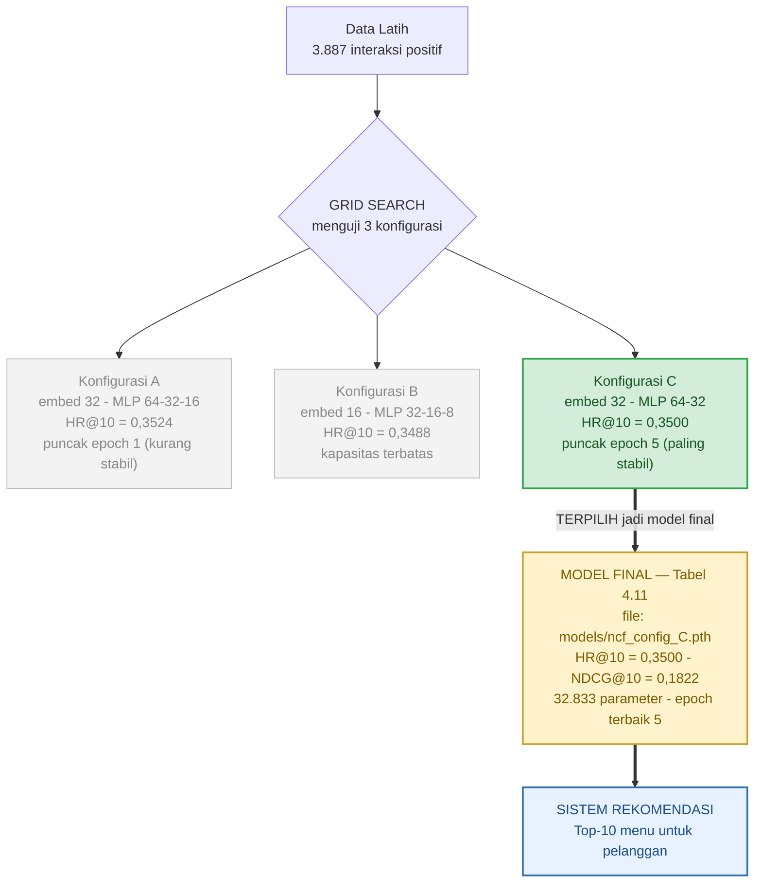

# Bagan Alur: Grid Search → Model Final → Sistem

Diagram ini menjelaskan hubungan antara **grid search** (pemilihan konfigurasi)
dan **model final** (Tabel 4.11) yang dipakai sistem.

## Cara membaca
1. **Data latih** masuk ke proses **Grid Search**.
2. Grid Search **menguji 3 konfigurasi** (A, B, C) dan membandingkannya.
3. **Konfigurasi C terpilih** (hijau) karena konvergensi paling stabil — meski HR A
   sedikit lebih tinggi, A tidak stabil (puncak di epoch 1).
4. Konfigurasi C yang terpilih **menjadi Model Final** (kuning) yang
   didokumentasikan lengkap di **Tabel 4.11** dan disimpan sebagai
   `ncf_config_C.pth`.
5. Model final itulah yang dipakai **Sistem Rekomendasi** untuk menghasilkan
   Top-10 menu bagi pelanggan.

> **Inti:** Konfigurasi C di grid search = model final di Tabel 4.11 (model yang
> sama). Grid Search adalah *proses memilih*, Tabel 4.11 adalah *profil pemenang*.
